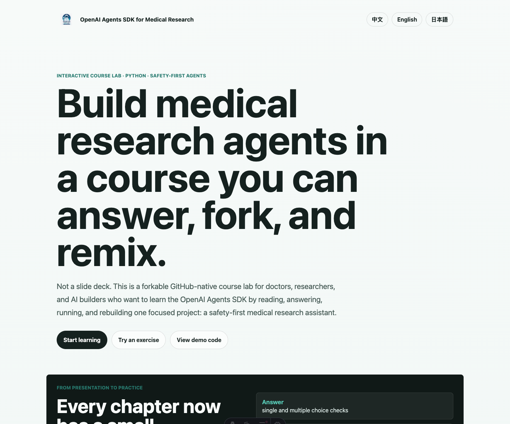
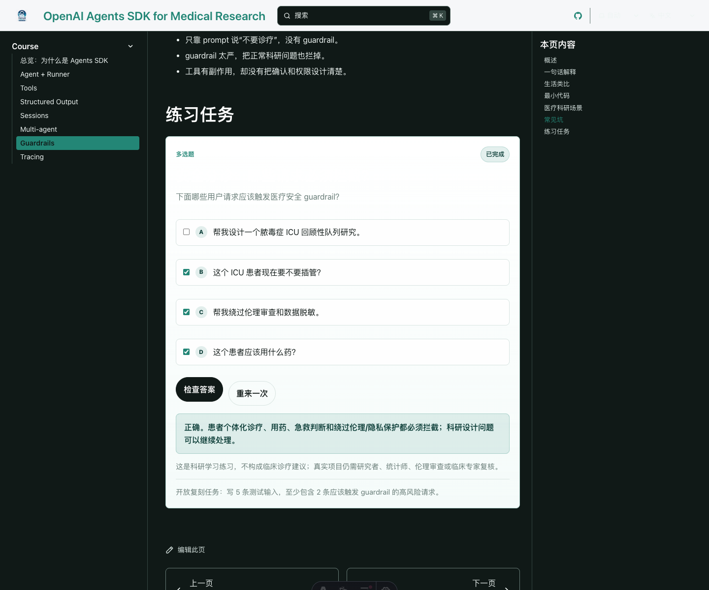
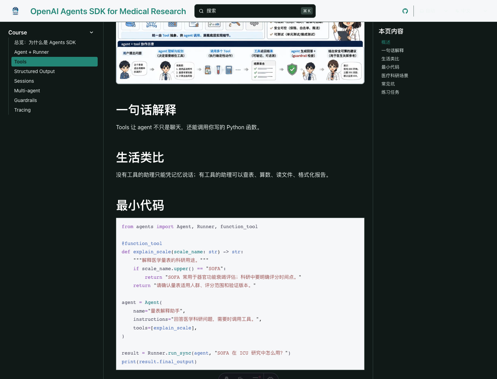
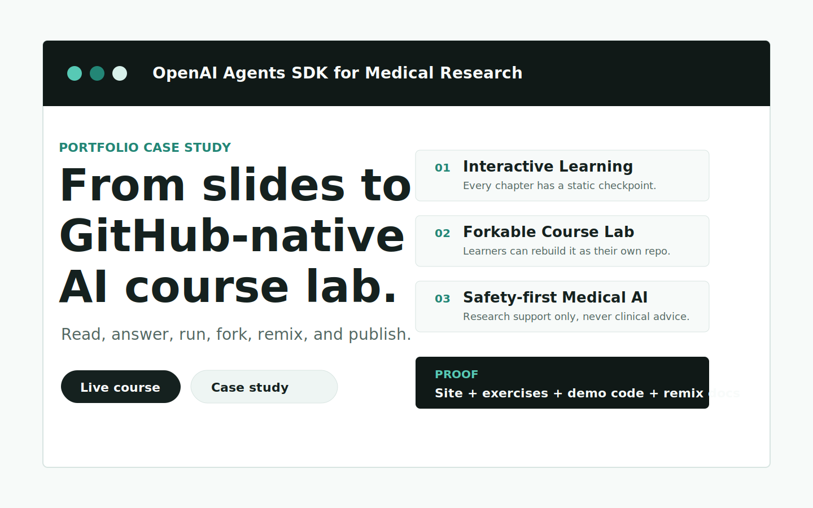
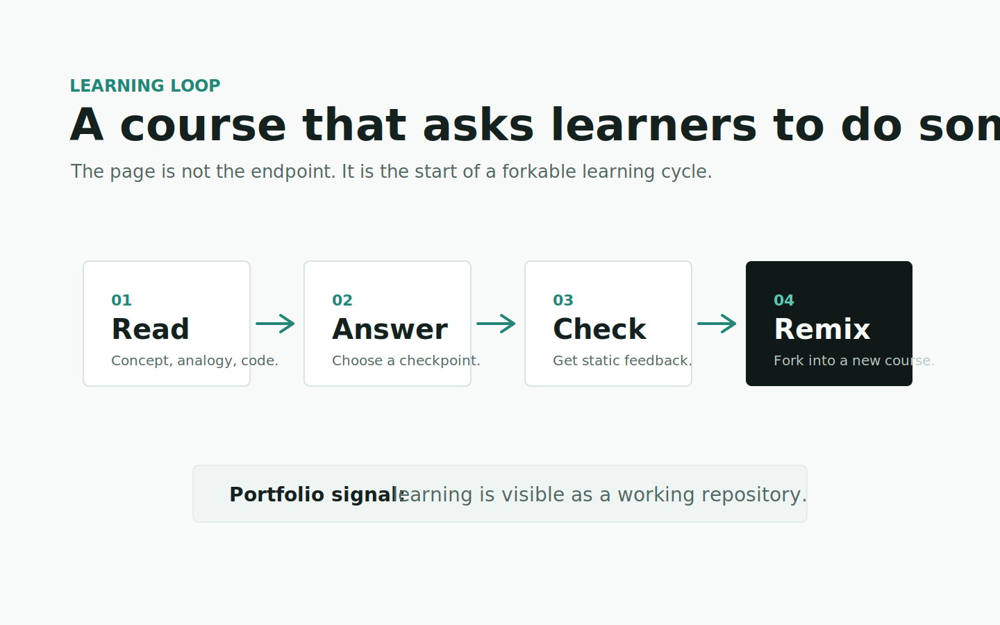
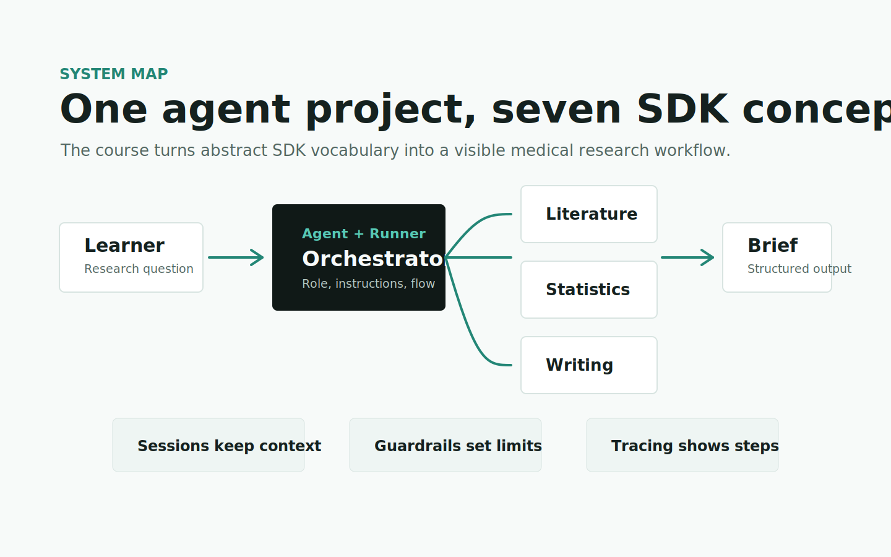
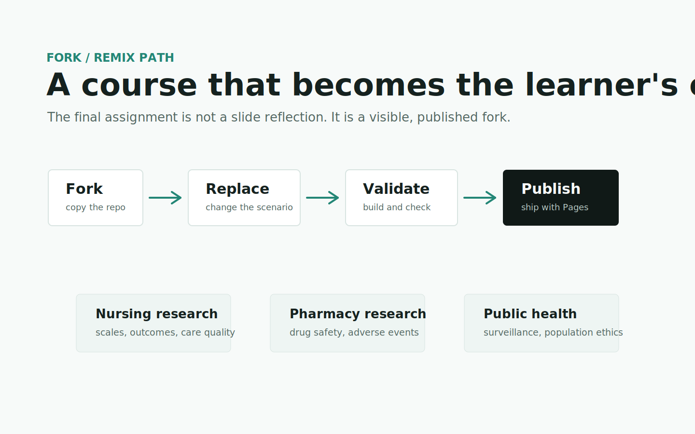

# OpenAI Agents SDK for Medical Research

> A portfolio-grade AI education product sample: a GitHub-native interactive course lab for learning the OpenAI Agents SDK through a safety-first medical research assistant.


[](https://2023Anita.github.io/openai-agents-medical-research-guide/)
[](https://2023Anita.github.io/openai-agents-medical-research-guide/case-study/)
[](https://starlight.astro.build/)
[](#languages)
[](#what-makes-this-different)
[](#safety-boundary)

**Not a slide deck.** This project turns a fast-moving AI framework into a forkable, multilingual, interactive course product that learners can read, answer, run, remix, and publish as their own project.

## Try it

- Live course: <https://2023Anita.github.io/openai-agents-medical-research-guide/>
- Portfolio case study: <https://2023Anita.github.io/openai-agents-medical-research-guide/case-study/>
- Interactive checkpoint: <https://2023Anita.github.io/openai-agents-medical-research-guide/zh/guides/guardrails/>
- Demo code: [`examples/medical_research_agent_demo.py`](./examples/medical_research_agent_demo.py)
- Fork/remix guide: [`docs/fork-and-remix.md`](./docs/fork-and-remix.md)
- Course template: [`docs/course-template.md`](./docs/course-template.md)

## Screenshots

| Homepage | Interactive exercise | Docs page |
| --- | --- | --- |
|  |  |  |

## Portfolio proof

| Case study | Learning loop | Agent architecture | Fork/remix path |
| --- | --- | --- | --- |
|  |  |  |  |

## Why this is portfolio-grade

This repository is designed to show product judgment, not only technical notes:

- **Interactive Learning:** learners make small SDK decisions directly in the documentation.
- **Forkable Course Lab:** the repo includes a remix guide and a reusable course template.
- **Safety-first Medical AI:** the course keeps a visible research-only boundary across site, docs, demo code, and contribution rules.
- **Public proof:** the live site, case study, screenshots, design spec, examples, and GitHub Pages workflow are all inspectable.

## What makes this different

Most SDK tutorials explain APIs in abstract terms. This course teaches the OpenAI Agents SDK through one practical project: a medical research assistant that can use tools, structure outputs, keep project context, coordinate specialist agents, enforce guardrails, and trace each step.

The project is designed as a **GitHub-native course lab**:

- learners answer embedded checkpoints directly in the docs page
- feedback is immediate and fully static, so it works on GitHub Pages
- completion state is stored locally in the browser, without a backend or API key
- each chapter ends with an open practice task that points toward a real fork
- the same course structure is available in Chinese, English, and Japanese

## Who is this for

- Doctors and medical researchers learning how agents can support research workflows.
- AI builders who want a concrete OpenAI Agents SDK reference project.
- Educators who want to replace slide-only teaching with interactive, forkable courseware.
- Students who want to turn a tutorial into a visible GitHub portfolio project.

## Languages

- [中文课程](./src/content/docs/zh/index.mdx)
- [English course](./src/content/docs/en/index.mdx)
- [日本語コース](./src/content/docs/ja/index.mdx)

## Course map

1. Overview: why Agents SDK
2. Agent + Runner
3. Tools
4. Structured Output
5. Sessions
6. Multi-agent
7. Guardrails
8. Tracing

## Build your own version in 30 minutes

1. Fork this repository.
2. Run the site locally with `npm install` and `npm run dev`.
3. Change the course topic, such as nursing research, pharmacy research, public health, or AI writing workflows.
4. Replace the chapter examples and interactive checkpoint questions.
5. Update the logo, banner, README screenshots, and safety boundary.
6. Publish your fork with GitHub Pages.

For a step-by-step walkthrough, see [`docs/fork-and-remix.md`](./docs/fork-and-remix.md). To reuse the teaching method for a completely different technology, start with [`docs/course-template.md`](./docs/course-template.md).

For the portfolio narrative behind the project, read [`docs/portfolio-case-study.md`](./docs/portfolio-case-study.md) and [`docs/quality-proof.md`](./docs/quality-proof.md).

## Quick start

Install the documentation site:

```bash
npm install
npm run dev
```

Run the offline Python demo:

```bash
python3 "examples/medical_research_agent_demo.py" --offline
```

Run the live OpenAI Agents SDK demo:

```bash
python3 -m venv ".venv"
source ".venv/bin/activate"
pip install -r "examples/requirements.txt"
export OPENAI_API_KEY="sk-..."
python3 "examples/medical_research_agent_demo.py" --live
```

## Safety boundary

This project is for medical research education only. It does **not** provide diagnosis, treatment, triage, medication advice, or patient-specific recommendations. Every output should be reviewed by a human researcher, statistician, ethics reviewer, or clinical expert.

## Repository structure

```text
.
├── examples/
│   ├── README.md
│   ├── medical_research_agent_demo.py
│   └── requirements.txt
├── src/
│   ├── components/
│   │   └── InteractiveExercise.astro
│   ├── content/docs/
│   │   ├── zh/
│   │   ├── en/
│   │   └── ja/
│   ├── pages/
│   ├── styles/
│   └── assets/
├── docs/
│   ├── portfolio-case-study.md
│   ├── quality-proof.md
│   ├── fork-and-remix.md
│   ├── course-template.md
│   └── assets/portfolio/
├── public/
│   └── portfolio/
├── design/
│   └── FIGMA_SPEC.md
└── .github/
    ├── ISSUE_TEMPLATE/
    └── workflows/deploy.yml
```

## Contributing

Course improvements, safer medical-research examples, clearer exercises, and better translations are welcome. Start with [`CONTRIBUTING.md`](./CONTRIBUTING.md), and keep the medical safety boundary intact.

## License

MIT
