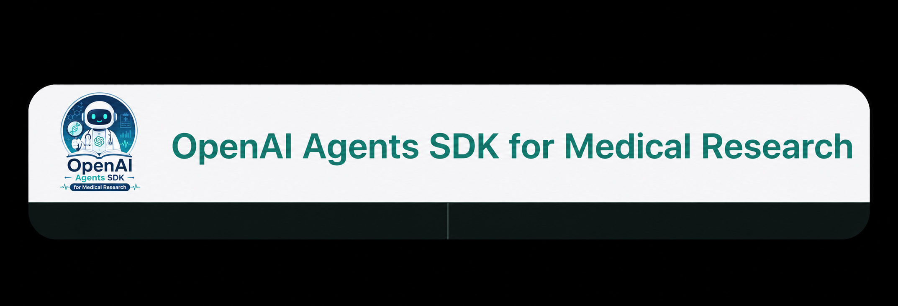

# OpenAI Agents SDK for Medical Research

> A multilingual, safety-first course for building medical research assistants with the OpenAI Agents SDK.



[](https://starlight.astro.build/)
[](#languages)
[](#safety-boundary)

## Why this project

Most Agents SDK tutorials explain the API in abstract terms. This guide teaches the SDK through one practical project: a medical research assistant that can use tools, structure outputs, keep project context, coordinate specialist agents, enforce safety guardrails, and trace each step.

This is not a clinical decision-support system. It is a learning project for research design, literature planning, statistical drafts, and manuscript structure.

## Interactive course lab

This project is designed as a GitHub-native course lab, not a slide deck. Each chapter now includes a small interactive checkpoint:

- choose an answer directly in the docs page
- get immediate correct/incorrect feedback
- keep lightweight completion state in the browser
- use the open practice prompt to fork, remix, and rebuild the project in your own domain

The first version is fully static and runs on GitHub Pages. It does not use a backend, login, database, or API key.

## Languages

- [中文课程](./src/content/docs/zh/index.mdx)
- [English course](./src/content/docs/en/index.mdx)
- [日本語コース](./src/content/docs/ja/index.mdx)

After GitHub Pages is enabled, the documentation site will be available at:

```text
https://2023Anita.github.io/openai-agents-medical-research-guide/
```

## Course map

1. Overview: why Agents SDK
2. Agent + Runner
3. Tools
4. Structured Output
5. Sessions
6. Multi-agent
7. Guardrails
8. Tracing

## Learning path

1. Read one short chapter.
2. Answer the embedded checkpoint.
3. Run or inspect the matching example code.
4. Fork the repository.
5. Replace the medical research scenario with your own teaching or research topic.
6. Publish your version as a GitHub Pages course.

## Quick start

Install the documentation site:

```bash
npm install
npm run dev
```

Run the offline Python demo:

```bash
python3 "examples/medical_research_agent_demo.py" --offline
```

Run the live OpenAI Agents SDK demo:

```bash
python3 -m venv ".venv"
source ".venv/bin/activate"
pip install -r "examples/requirements.txt"
export OPENAI_API_KEY="sk-..."
python3 "examples/medical_research_agent_demo.py" --live
```

## Safety boundary

This project is for medical research education only. It does not provide diagnosis, treatment, triage, medication advice, or patient-specific recommendations. Every output should be reviewed by a human researcher, statistician, ethics reviewer, or clinical expert.

## Repository structure

```text
.
├── examples/
│   ├── medical_research_agent_demo.py
│   └── requirements.txt
├── src/
│   ├── components/
│   │   └── InteractiveExercise.astro
│   ├── content/docs/
│   │   ├── zh/
│   │   ├── en/
│   │   └── ja/
│   ├── pages/
│   ├── styles/
│   └── assets/
├── design/
│   └── FIGMA_SPEC.md
└── .github/workflows/deploy.yml
```

## Design direction

The visual direction is professional, restrained, and research-oriented: cold white background, deep ink typography, medical blue and mint accents, low-saturation dark code surfaces, and concise course cards.

See [design/FIGMA_SPEC.md](./design/FIGMA_SPEC.md) for the page-level Figma brief.

## Deployment

This repository is prepared for GitHub Pages through `.github/workflows/deploy.yml`. Creating the remote GitHub repository, committing, pushing, and enabling Pages are intentionally left as explicit release steps.

## License

MIT
