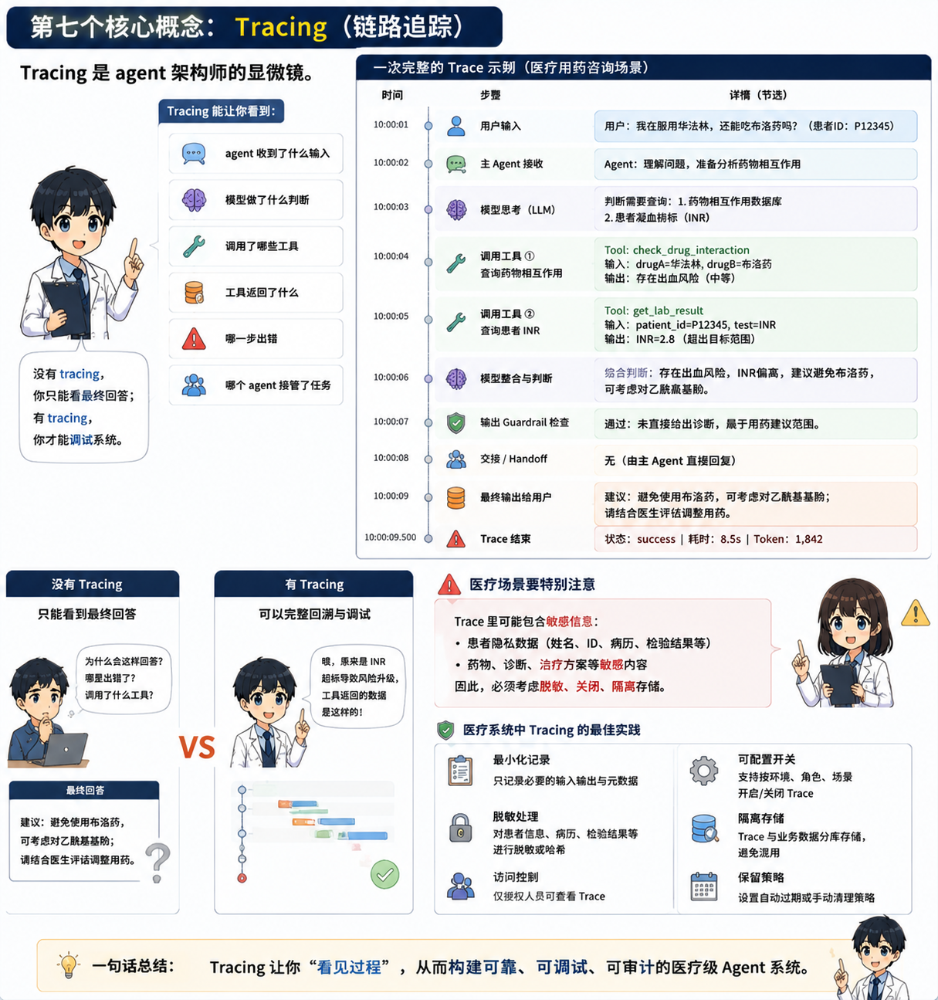

import InteractiveExercise from '../../../../components/InteractiveExercise.astro';



## One-sentence explanation

Tracing makes the agent workflow visible.

## Analogy

A research assistant should not only give you a draft. You should know what they checked, which specialist they asked, and where the misunderstanding happened.

## Minimal code

```python
from agents import Agent, Runner, trace

agent = Agent(name="Research Assistant", instructions="Answer research design questions.")

with trace("medical_research_demo"):
    result = Runner.run_sync(agent, "Help decompose an ICU retrospective study question.")

print(result.final_output)
```

## Medical research use

Tracing helps you answer:

- Was the literature assistant actually called?
- Why did the statistics assistant suggest logistic regression?
- Did the guardrail block a valid research question?
- Was a bad answer caused by the model, the tool, or the prompt?

## Common mistakes

- Guessing from final answers instead of checking traces.
- Putting sensitive inputs into traces without data governance.
- Forgetting workflow names in production.

## Exercise

<InteractiveExercise
  id={"en-tracing-interactive-check"}
  kind={"multiple"}
  title={"Trace review: what should a complete run show?"}
  prompt={"When checking a complete run in the Trace viewer, which signals are key evidence?"}
  options={[
  {
    "id": "a",
    "label": "Which agent ran."
  },
  {
    "id": "b",
    "label": "Which tools were called, with reasonable inputs and outputs."
  },
  {
    "id": "c",
    "label": "Whether a guardrail triggered and why."
  },
  {
    "id": "d",
    "label": "Whether the final output follows the structure and safety boundary."
  },
  {
    "id": "e",
    "label": "The user API key in plain text."
  }
]}
  answers={["a","b","c","d"]}
  feedback={{
  "correct": "Correct. Trace explains agents, tools, guardrails, and final output flow; it should not expose secrets.",
  "incorrect": "Try again: Trace should help debug the execution path, but secrets must not appear as debugging evidence.",
  "required": "Choose an answer before checking.",
  "completed": "Correct. Trace explains agents, tools, guardrails, and final output flow; it should not expose secrets."
}}
  checkLabel={"Check answer"}
  resetLabel={"Try again"}
  completedLabel={"Completed"}
  typeLabel={"Multiple choice"}
  reviewNote={"This is a research-learning exercise, not clinical advice. Real projects still need human review by researchers, statisticians, ethics reviewers, or clinical experts."}
  openPractice={"Open practice: run one real example and confirm which agents, tools, and guardrails appear in the Trace viewer."}
/>
