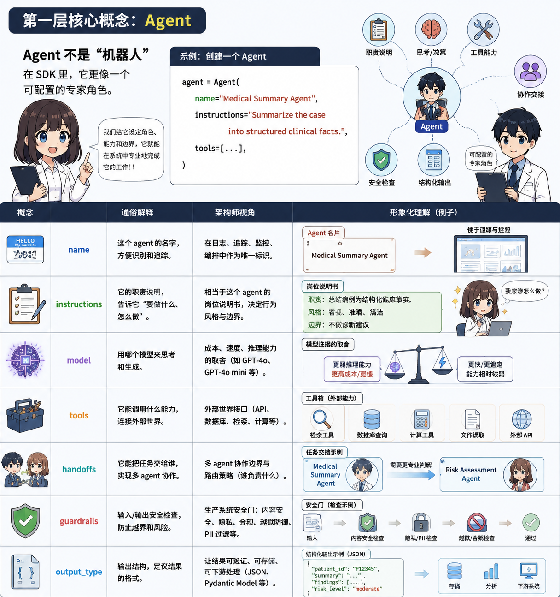

import InteractiveExercise from '../../../../components/InteractiveExercise.astro';



## 一言で説明

`Agent` は「誰が作業するか」を定義し、`Runner` は「その作業を実行する」役割です。

## たとえ

`Agent` はあなたが依頼する研究助手です。`Runner` はその助手にタスクを渡して結果を待つ仕組みです。

## 最小コード

```python
from agents import Agent, Runner

agent = Agent(
    name="Medical Research Assistant",
    instructions="Only answer medical research design questions. Do not provide diagnosis or treatment advice.",
)

result = Runner.run_sync(
    agent,
    "Can dynamic SOFA changes predict 28-day mortality in ICU sepsis patients?",
)
print(result.final_output)
```

## 医療研究での使い方

最初は研究課題の分解だけを依頼します。基本の役割が安定してから、ツール、記憶、複数 agent、安全境界を追加します。

## よくある失敗

- 指示が曖昧で出力が安定しない。
- 医療境界を書かず、臨床助言に寄ってしまう。
- 最初から multi-agent にしてデバッグが難しくなる。

## 練習

<InteractiveExercise
  id={"ja-agent-runner-interactive-check"}
  kind={"single"}
  title={"役割境界：看護研究アシスタントの指示は？"}
  prompt={"agent を「看護研究アシスタント」に変えるなら、最も安全な instructions はどれですか？"}
  options={[
  {
    "id": "a",
    "label": "万能の医療アシスタントとして、患者質問も研究質問もすべて答える。"
  },
  {
    "id": "b",
    "label": "患者状況に基づいて看護診断や治療助言を出してよい。"
  },
  {
    "id": "c",
    "label": "看護研究デザイン、尺度選択、論文構成だけに答え、診断、治療、トリアージ、患者個別助言は行わない。"
  },
  {
    "id": "d",
    "label": "不確実性を書かず、完全な論文生成を優先する。"
  }
]}
  answers={["c"]}
  feedback={{
  "correct": "正解です。最初に役割と境界を決めます。看護研究支援は範囲内、患者個別の臨床助言は範囲外です。",
  "incorrect": "この指示はまだ安全ではありません。よい agent 指示は「できること」と「拒否すること」の両方を書きます。",
  "required": "答えを選んでから確認してください。",
  "completed": "正解です。最初に役割と境界を決めます。看護研究支援は範囲内、患者個別の臨床助言は範囲外です。"
}}
  checkLabel={"答えを確認"}
  resetLabel={"もう一度"}
  completedLabel={"完了"}
  typeLabel={"単一選択"}
  reviewNote={"これは研究学習用の練習であり、臨床助言ではありません。実際の研究では研究者、統計家、倫理審査、臨床専門家による確認が必要です。"}
  openPractice={"発展課題：例の agent を看護研究アシスタントに変更し、同じ安全境界を残してください。"}
/>
