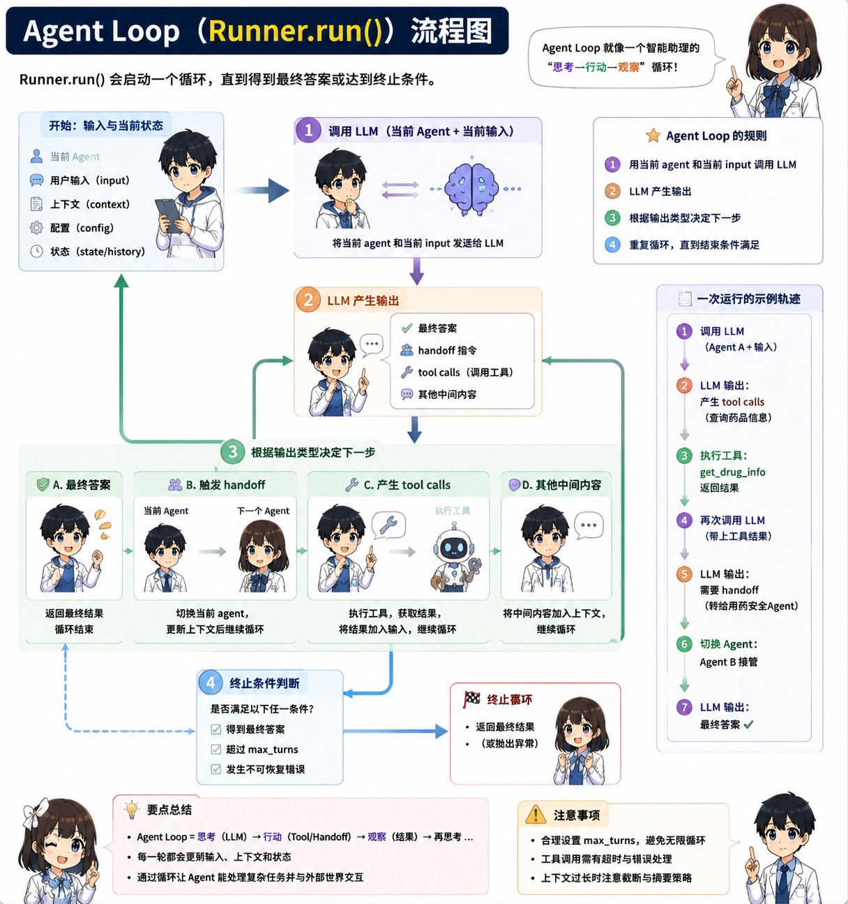

> このコースは「医療研究アシスタント」という一つのプロジェクトを通して OpenAI Agents SDK を学びます。境界は明確です。研究設計、文献計画、統計草案、論文構成を支援しますが、診断、治療、トリアージ、投薬、患者個別の助言は扱いません。



## 覚える一文

`Agent は役割を決め、Runner は流れを動かし、Tools は仕事をし、Handoffs は専門家へ渡し、Guardrails は境界を守り、Sessions は文脈を残し、Tracing は過程を見せる。`

## 対象者

- 医師、看護師、研究学習者で、AI を論文や研究ワークフローに使いたい人。
- 抽象的なインフラよりも医療シナリオで Agent を理解したい人。
- 安全で説明可能、デバッグしやすい研究アシスタントを作りたい開発者。

## コース構成

1. [概要：なぜ Agents SDK なのか](./guides/overview/)
2. [Agent + Runner](./guides/agent-runner/)
3. [Tools](./guides/tools/)
4. [Structured Output](./guides/structured-output/)
5. [Sessions](./guides/sessions/)
6. [Multi-agent](./guides/multi-agent/)
7. [Guardrails](./guides/guardrails/)
8. [Tracing](./guides/tracing/)

## デモを実行

```bash
cd openai-agents-medical-research-guide
python3 "examples/medical_research_agent_demo.py" --offline
```

実際の SDK モード：

```bash
python3 -m venv ".venv"
source ".venv/bin/activate"
pip install -r "examples/requirements.txt"
export OPENAI_API_KEY="sk-..."
python3 "examples/medical_research_agent_demo.py" --live
```

## 安全に関する注意

このプロジェクトは医療研究教育のためのものです。すべての出力は人間の研究者、統計家、倫理審査担当者、臨床専門家による確認が必要です。

