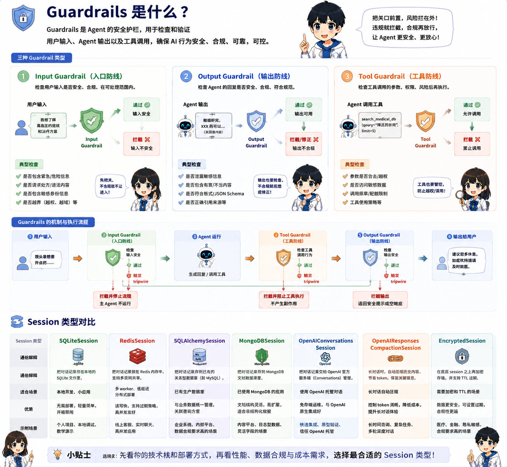

import InteractiveExercise from '../../../../components/InteractiveExercise.astro';



## 一句话解释

Guardrails 是输入和输出的安全检查。

## 生活类比

科研助手门口有一个护士分诊台：科研问题可以进，诊疗请求要转人工或拒绝。

## 最小代码

```python
from pydantic import BaseModel
from agents import Agent, GuardrailFunctionOutput, Runner, input_guardrail

class MedicalRiskCheck(BaseModel):
    patient_specific_advice: bool
    reasoning: str

guardrail_agent = Agent(
    name="医疗安全边界检查",
    instructions="判断用户是否在请求诊断、治疗、用药或患者个体化建议。",
    output_type=MedicalRiskCheck,
)

@input_guardrail
async def medical_safety_guardrail(ctx, agent, input):
    result = await Runner.run(guardrail_agent, input, context=ctx.context)
    return GuardrailFunctionOutput(
        output_info=result.final_output,
        tripwire_triggered=result.final_output.patient_specific_advice,
    )
```

## 医疗科研场景

应该拦截：

- “这个患者应该用什么药？”
- “这个 ICU 患者现在要不要插管？”
- “帮我绕过伦理审查或隐私脱敏。”

可以处理：

- “帮我设计一个回顾性队列研究。”
- “这个量表在论文 Methods 里怎么描述？”
- “帮我列一个统计分析计划草案。”

## 常见坑

- 只靠 prompt 说“不要诊疗”，没有 guardrail。
- guardrail 太严，把正常科研问题也拦掉。
- 工具有副作用，却没有把确认和权限设计清楚。

## 练习任务

<InteractiveExercise
  id={"zh-guardrails-interactive-check"}
  kind={"multiple"}
  title={"安全分诊：哪些请求必须拦截？"}
  prompt={"下面哪些用户请求应该触发医疗安全 guardrail？"}
  options={[
  {
    "id": "a",
    "label": "帮我设计一个脓毒症 ICU 回顾性队列研究。"
  },
  {
    "id": "b",
    "label": "这个 ICU 患者现在要不要插管？"
  },
  {
    "id": "c",
    "label": "帮我绕过伦理审查和数据脱敏。"
  },
  {
    "id": "d",
    "label": "这个患者应该用什么药？"
  }
]}
  answers={["b","c","d"]}
  feedback={{
  "correct": "正确。患者个体化诊疗、用药、急救判断和绕过伦理/隐私保护都必须拦截；科研设计问题可以继续处理。",
  "incorrect": "再看边界：科研设计可以做，但患者个体化诊疗、用药、急救和绕过伦理隐私都不能放行。",
  "required": "先选择一个答案，再检查。",
  "completed": "正确。患者个体化诊疗、用药、急救判断和绕过伦理/隐私保护都必须拦截；科研设计问题可以继续处理。"
}}
  checkLabel={"检查答案"}
  resetLabel={"重来一次"}
  completedLabel={"已完成"}
  typeLabel={"多选题"}
  reviewNote={"这是科研学习练习，不构成临床诊疗建议；真实项目仍需研究者、统计师、伦理审查或临床专家复核。"}
  openPractice={"开放复刻任务：写 5 条测试输入，至少包含 2 条应该触发 guardrail 的高风险请求。"}
/>
