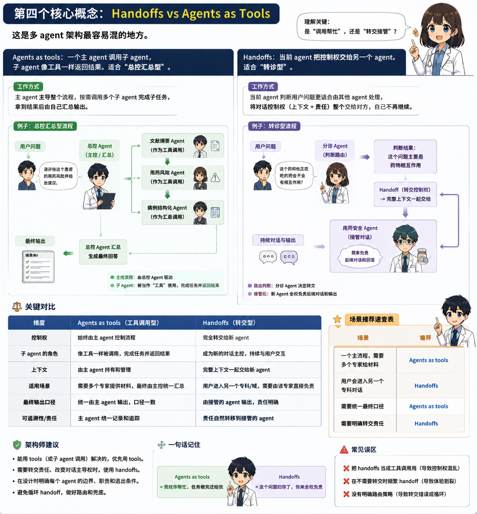

import InteractiveExercise from '../../../../components/InteractiveExercise.astro';



## 一句话解释

Multi-agent 是把复杂任务拆给多个专业 agent。

## 生活类比

一篇医学论文不是一个人闭眼写完的。你可能需要文献老师、统计老师、写作老师一起协作。

## 最小代码

```python
from agents import Agent, Runner

literature_agent = Agent(name="文献助手", instructions="只负责检索思路和证据总结。")
statistics_agent = Agent(name="统计助手", instructions="只负责研究设计和统计方法建议。")

orchestrator = Agent(
    name="医疗科研主助手",
    instructions="调用专家工具，整合成简洁科研草案。",
    tools=[
        literature_agent.as_tool(
            tool_name="literature_helper",
            tool_description="提供文献检索思路和证据线索。",
        ),
        statistics_agent.as_tool(
            tool_name="statistics_helper",
            tool_description="提供研究设计和统计分析建议。",
        ),
    ],
)

result = Runner.run_sync(orchestrator, "帮我设计一个 ICU 脓毒症回顾性研究。")
print(result.final_output)
```

## 医疗科研场景

优先用主 agent 控制最终答案，把专家 agent 包装成工具。这样安全边界、输出格式和语气更统一。

## 常见坑

- 每个 agent 都写成“全能助手”，分工形同虚设。
- 专家太多，成本上升，调试困难。
- 没有主 agent 汇总，用户看到一堆碎片答案。

## 练习任务

<InteractiveExercise
  id={"zh-multi-agent-interactive-check"}
  kind={"single"}
  title={"多 Agent 分工：谁来汇总最终答案？"}
  prompt={"文献助手、统计助手、伦理助手都加入后，哪种协作方式最适合第一版课程项目？"}
  options={[
  {
    "id": "a",
    "label": "让三个 specialist agents 分别直接回复用户，不需要主 agent。"
  },
  {
    "id": "b",
    "label": "让统计助手决定所有医学安全边界。"
  },
  {
    "id": "c",
    "label": "由主 agent 调用 specialist agents，再统一汇总答案、风险提示和人工复核提醒。"
  },
  {
    "id": "d",
    "label": "让每个 agent 都可以自由调用所有工具和输出最终结论。"
  }
]}
  answers={["c"]}
  feedback={{
  "correct": "正确。第一版应让主 agent 统一调度和汇总，这样输出格式、安全边界和语气更可控。",
  "incorrect": "再想想：多 agent 不是让所有专家各说各话，而是需要一个主 agent 负责整合和边界。",
  "required": "先选择一个答案，再检查。",
  "completed": "正确。第一版应让主 agent 统一调度和汇总，这样输出格式、安全边界和语气更可控。"
}}
  checkLabel={"检查答案"}
  resetLabel={"重来一次"}
  completedLabel={"已完成"}
  typeLabel={"单选题"}
  reviewNote={"这是科研学习练习，不构成临床诊疗建议；真实项目仍需研究者、统计师、伦理审查或临床专家复核。"}
  openPractice={"开放复刻任务：新增 `ethics_agent`，并让主 agent 把伦理风险纳入最终输出。"}
/>
